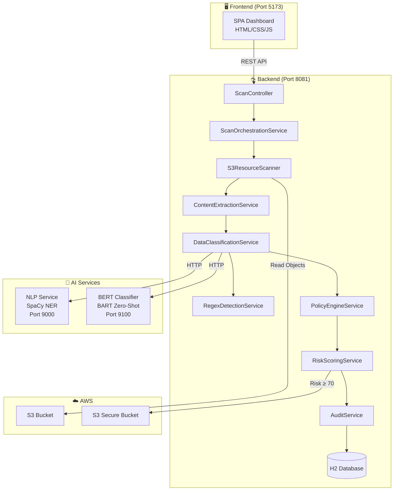
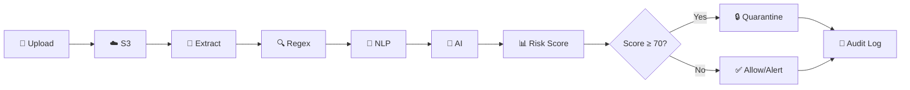

<div align="center">

# 🛡️ AI Cloud Data Security Scanner

**An intelligent cloud-native platform for automated sensitive data detection, classification, and protection in AWS S3.**

[](https://openjdk.org/)
[](https://spring.io/projects/spring-boot)
[](https://python.org)
[](https://fastapi.tiangolo.com/)
[](https://aws.amazon.com/s3/)
[](LICENSE)

---

*Automatically scan cloud files for PII, classify sensitivity with AI, enforce data protection policies, and quarantine high-risk content — all in real time.*

</div>

---

## 📋 Overview

Organizations storing data in AWS S3 face the constant risk of unintentional PII and secrets exposure. Manual auditing is error-prone, slow, and doesn't scale.

**AI Cloud Data Security Scanner** solves this with a multi-layered, automated scanning pipeline that:

1. **Extracts** content from 15+ file formats (text, PDF, Office, images via OCR, binary)
2. **Detects** sensitive data using three complementary methods: regex patterns, NLP entity recognition (SpaCy), and zero-shot AI classification (BART)
3. **Scores** risk using a composite algorithm factoring detection results, S3 exposure, encryption status, and extraction outcomes
4. **Enforces** policies automatically — quarantining critical-risk files to a secure bucket
5. **Audits** every action with comprehensive logging and a real-time dashboard

---

## ✨ Features

### 🔍 Multi-Layer Detection
- **Regex Engine** — Pattern matching for Aadhaar, PAN, SSN, credit cards, API keys, JWT tokens, private keys, database passwords
- **NLP Engine** — SpaCy Named Entity Recognition detecting PERSON, ORG, LOCATION, and EMAIL entities
- **AI Engine** — HuggingFace BART zero-shot classification into CONFIDENTIAL_DOCUMENT, PAYMENT_INFORMATION, INTERNAL_DATA, PUBLIC_CONTENT

### 📄 Multi-Format Extraction
- Plain text (`.txt`, `.csv`, `.json`, `.xml`, `.yml`, `.java`, `.py`, `.js`, `.sql`, `.log`)
- PDF documents (Apache PDFBox)
- Office documents — `.docx`, `.xlsx`, `.pptx` (Apache POI)
- Images — OCR via Tesseract/Tess4J (optional)
- Binary files — printable string extraction
- Encrypted files — detection and flagging

### ⚡ Automated Risk & Policy
- Composite risk scoring (0–100) with severity levels: CRITICAL, HIGH, MEDIUM, LOW
- Auto-quarantine for critical-risk files (score ≥ 70) to a secure S3 bucket
- Real-time data masking for detected PII before persistence
- AI service resilience with retries, circuit breaker, and graceful degradation

### 📊 Dashboard & Admin
- Glassmorphism dark-themed SPA dashboard
- Real-time KPI cards (total scans, high-risk files, risk distribution)
- Scan history explorer with pagination, filtering, and sorting
- Manual scan and batch scan interfaces
- Drag-and-drop file upload with pre-signed S3 URLs
- Admin panel with audit logs and S3 metadata

---

## 🏗️ Architecture



### Data Flow



---

## 🛠️ Tech Stack

| Layer | Technology | Version | Purpose |
|-------|-----------|---------|---------|
| **Backend** | Java | 21 | Core language |
| | Spring Boot | 3.4.2 | REST API framework |
| | Spring Security | (managed) | HTTP Basic Auth |
| | Spring Data JPA | (managed) | ORM / persistence |
| | H2 Database | (managed) | In-memory database |
| | AWS SDK v2 (S3, STS) | 2.25.60 | Cloud storage integration |
| | Apache Tika | 2.9.2 | File type detection |
| | Apache PDFBox | 2.0.31 | PDF extraction |
| | Apache POI | 5.2.5 | Office document extraction |
| | Tess4J | 5.11.0 | OCR (Tesseract wrapper) |
| **AI Services** | Python | 3.10+ | AI microservices language |
| | FastAPI | ≥0.115 | Async API framework |
| | SpaCy | ≥3.8 | Named Entity Recognition |
| | Transformers | ≥4.48 | HuggingFace models |
| | PyTorch | ≥2.0 | ML framework |
| **Frontend** | HTML5 / CSS3 / JS | — | SPA dashboard |
| | Google Fonts | Inter, JetBrains Mono | Typography |

---

## 📁 Project Structure

```
ai-cloud-data-security_V3/
│
├── cloudscanner/                    # ☕ Spring Boot backend
│   ├── src/main/java/com/security/cloudscanner/
│   │   ├── CloudscannerApplication.java
│   │   ├── audit/                   # Audit logging (controller, entity, repo, service)
│   │   ├── config/                  # AWS, CORS, Security, HTTP client configs
│   │   ├── controller/              # REST API controllers (Scan, Upload, Dashboard, Metadata)
│   │   ├── entity/                  # JPA entities (ScanResult, S3MetadataEntity)
│   │   ├── exception/               # Global exception handling
│   │   ├── extraction/              # Content extraction pipeline
│   │   │   └── extractors/          # Format-specific extractors (PDF, Office, OCR, etc.)
│   │   ├── policy/                  # Policy engine (evaluation, decisions)
│   │   ├── repository/              # Spring Data JPA repositories
│   │   ├── risk/                    # Risk scoring service
│   │   ├── scanner/                 # S3 resource scanning
│   │   └── service/                 # Core services (classification, detection, orchestration)
│   ├── src/main/resources/          # application.yml, application.properties
│   ├── src/test/                    # Unit tests
│   ├── .env.example                 # Environment variable template
│   └── pom.xml                      # Maven dependencies
│
├── ai-services/                     # 🐍 Python AI microservices
│   ├── nlp_service.py               # SpaCy NER service (port 9000)
│   ├── bert_classifier.py           # BART classifier service (port 9100)
│   ├── requirements.txt             # Python dependencies
│   └── README.md                    # AI services documentation
│
├── frontend/                        # 🖥️ SPA dashboard
│   ├── ai-security-dashboard.html   # Main HTML page
│   ├── app.js                       # UI logic & state management
│   ├── api.js                       # API client with caching
│   └── styles.css                   # Glassmorphism dark theme
│
├── test-files/                      # 📄 Sample test data for scanning
│   ├── creditcard.txt
│   ├── financial_report.json
│   ├── highly_confidential_credit_cards.csv
│   ├── medical_records.txt
│   ├── public_readme.txt
│   ├── sensitive_customer_data.csv
│   └── server_logs.log
│
├── docs/                            # 📚 Documentation
│   ├── ARCHITECTURE.md              # Detailed architecture guide
│   └── TECHNICAL_REPORT.md          # Technical report
│
├── CHANGELOG.md                     # Version history
├── README.md                        # This file
└── .gitignore                       # Git ignore rules
```

---

## 🚀 Installation

### Prerequisites

| Requirement | Version | Required |
|-------------|---------|----------|
| Java JDK | 21+ | ✅ |
| Python | 3.10+ | ✅ |
| Maven | 3.9+ (or use included `mvnw`) | ✅ |
| AWS Account | with S3 access | ✅ |
| Tesseract OCR | Latest | ❌ Optional (for image scanning) |

### Step 1: Clone the Repository

```bash
git clone https://github.com/yourusername/ai-cloud-data-security.git
cd ai-cloud-data-security
```

### Step 2: Configure AWS Credentials

```bash
cd cloudscanner
cp .env.example .env
```

Edit `.env` with your AWS credentials:

```env
AWS_ACCESS_KEY_ID=your_access_key
AWS_SECRET_ACCESS_KEY=your_secret_key
AWS_DEFAULT_REGION=ap-south-1
```

### Step 3: Install Python Dependencies

```bash
cd ai-services
python3 -m venv venv
source venv/bin/activate
pip install -r requirements.txt
python -m spacy download en_core_web_sm
```

---

## 🏃 Running Locally

Open **four** terminal windows:

### Terminal 1 — NLP Service

```bash
cd ai-services
source venv/bin/activate
uvicorn nlp_service:app --host 0.0.0.0 --port 9000
```

### Terminal 2 — BERT Classifier

```bash
cd ai-services
source venv/bin/activate
uvicorn bert_classifier:app --host 0.0.0.0 --port 9100
```

### Terminal 3 — Spring Boot Backend

```bash
cd cloudscanner
./mvnw spring-boot:run
```

### Terminal 4 — Frontend

```bash
cd frontend
python3 -m http.server 5173
```

### Access the Application

| Service | URL |
|---------|-----|
| **Dashboard** | [http://localhost:5173/ai-security-dashboard.html](http://localhost:5173/ai-security-dashboard.html) |
| **Backend API** | [http://localhost:8081](http://localhost:8081) |
| **NLP Service** | [http://localhost:9000](http://localhost:9000) |
| **BERT Classifier** | [http://localhost:9100](http://localhost:9100) |
| **H2 Console** | [http://localhost:8081/h2-console](http://localhost:8081/h2-console) |

### Default Credentials

| Username | Password | Role | Access |
|----------|----------|------|--------|
| `user` | `user123` | USER | Dashboard, Scans, Uploads |
| `admin` | `admin123` | ADMIN | All above + Audit Logs, Metadata |

> **Note:** If AI services are down, the backend continues to operate with graceful degradation — NLP and AI findings will be empty, but regex detection and the pipeline still function.

---

## 🔧 Environment Variables

| Variable | Description | Default | Required |
|----------|-------------|---------|----------|
| `AWS_ACCESS_KEY_ID` | AWS IAM access key | — | ✅ |
| `AWS_SECRET_ACCESS_KEY` | AWS IAM secret key | — | ✅ |
| `AWS_DEFAULT_REGION` | AWS region | `ap-south-1` | ✅ |
| `AWS_PROFILE` | Named AWS profile (alternative to keys) | — | ❌ |
| `AWS_SESSION_TOKEN` | STS session token | — | ❌ |

### Application Configuration (`application.yml`)

| Property | Description | Default |
|----------|-------------|---------|
| `server.port` | Backend server port | `8081` |
| `aws.s3.bucket` | Source S3 bucket name | — |
| `aws.s3.sensitive-bucket` | Quarantine bucket name | — |
| `aws.s3.max-file-size` | Max file size for scanning | `10485760` (10 MB) |
| `ai.nlp.url` | NLP service endpoint | `http://localhost:9000/detect` |
| `ai.classifier.url` | BERT classifier endpoint | `http://localhost:9100/classify` |

---

## 🏗️ Build Instructions

### Backend (Production JAR)

```bash
cd cloudscanner
./mvnw clean package -DskipTests
java -jar target/cloudscanner-0.0.1-SNAPSHOT.jar
```

### Run Tests

```bash
cd cloudscanner
./mvnw test
```

---

## 📸 Screenshots

> Screenshots of the dashboard UI can be added here.

| View | Description |
|------|-------------|
| Login | Glassmorphism login with animated background |
| Dashboard | KPI cards, risk donut chart, high-risk files table |
| Scan History | Paginated scan results with filters and sorting |
| Manual Scan | Single and batch scan interfaces |
| File Upload | Drag-and-drop upload with progress tracking |
| Admin Panel | Audit logs and S3 metadata tables |

---

## 🔮 Future Improvements

- [ ] **PostgreSQL** — Replace H2 with production-grade database
- [ ] **Apache Kafka** — Event-driven scanning with async message queues
- [ ] **OAuth2 / JWT** — Production-grade authentication
- [ ] **Docker Compose** — Containerized deployment for all services
- [ ] **CI/CD Pipeline** — GitHub Actions for automated build, test, deploy
- [ ] **Cloud OCR** — AWS Textract or Google Vision for enhanced image scanning
- [ ] **WebSocket Notifications** — Real-time scan completion alerts
- [ ] **React/Vite Frontend** — Modern component-based frontend
- [ ] **Expanded Test Coverage** — Integration tests, E2E tests
- [ ] **Secrets Management** — AWS Secrets Manager or HashiCorp Vault

---

## 🤝 Contributing

Contributions are welcome! Please follow these steps:

1. **Fork** the repository
2. **Create** a feature branch (`git checkout -b feature/amazing-feature`)
3. **Commit** your changes (`git commit -m 'Add amazing feature'`)
4. **Push** to the branch (`git push origin feature/amazing-feature`)
5. **Open** a Pull Request

### Guidelines
- Follow existing code style and naming conventions
- Write unit tests for new features
- Update documentation for significant changes
- Keep commits atomic and well-described

---

## 📄 License

This project is licensed under the MIT License — see the [LICENSE](LICENSE) file for details.

---

<div align="center">

**Built with ❤️ for Cloud Security**

*If this project helped you, consider giving it a ⭐*

</div>
